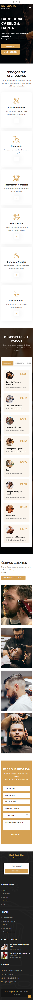

# Barb&aria! 

## Resumo

Barb&aria é um site responsivo e interativo onde você pode fazer sua reserva e escolher seu Barbeiro preferido podendo ligar ou fazer reserva por email, e também possui animações poderosas com o "Animate.css e WOW.js" funciona em todos os dispositivos desktop, tablets e smartphones. 
(Também fiz alguns ajustes e mudanças para uma melhor experiência do usuário) 
Projeto acadêmico, apenas para demontração.

## Tecnologias utilizadas

    
    
    

## Imagem completa do site
### Desktop

### Mobile

## Acesse o Projeto

Você pode acessar o projeto através do link abaixo:

➜ [Link da Barbearia](https://ezequiel-lee.github.io/barbearia/)

## Agradecimentos

(Agradecimentos ao canal Codewithsadee pelo conhecimento!)
